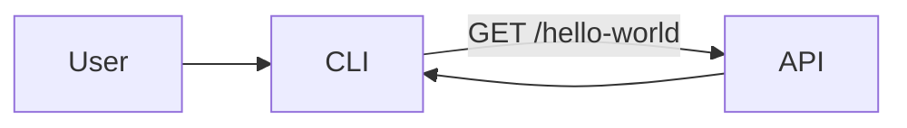

# AGENTS.md

Agent-facing guide for the **meawhooks** monorepo. For human setup instructions, see [README.md](README.md).

## Overview

- **Project**: meawhooks
- **Type**: Bun monorepo orchestrated with Turborepo
- **Apps**: `@meawhooks/api` (ElysiaJS HTTP API) and `@meawhooks/cli` (Ink terminal CLI)
- **Not in scope yet**: frontend, database, authentication, shared `packages/`

## Repository layout

```text
meawhooks/
├── apps/
│   ├── api/          # HTTP API (ElysiaJS)
│   └── cli/          # Terminal CLI (Ink + React)
├── package.json      # Bun workspaces root
├── turbo.json        # Turborepo task pipeline
├── tsconfig.base.json
├── README.md         # Human-facing setup guide
└── AGENTS.md         # Agent-facing project guide
```

Current request flow:



## Apps

### API — `apps/api`

- **Entry**: [apps/api/src/index.ts](apps/api/src/index.ts)
- **Routes**:
  - `GET /health` → `{ "status": "ok" }`
  - `GET /hello-world` → `{ "message": "Hello, World!" }`
- **Port**: `PORT` env var (default `3000`)
- **Stack**: Bun, TypeScript, ElysiaJS

### CLI — `apps/cli`

- **Entry**: [apps/cli/src/index.tsx](apps/cli/src/index.tsx)
- **Binary**: `meawhooks`
- **Commands**: one command today — `hello-world`
- **Command modules**: [apps/cli/src/commands/](apps/cli/src/commands/)
- **API base URL**: `API_URL` env var (default `http://localhost:3000`)
- **Stack**: Bun, TypeScript, Ink 7, React 19

## Commands

| Command | Purpose |
|---------|---------|
| `bun install` | Install all workspace dependencies |
| `bun dev` | Start the API in watch mode via Turbo |
| `bun hello` | Run the CLI `hello-world` command against a running API |
| `bun run build` | Build all apps via Turbo |
| `bun run lint` | Typecheck all apps (`tsc --noEmit`) |

Use `bun run build`, not `bun build` alone — the latter invokes Bun's native bundler instead of the root script.

Filter a specific workspace when needed:

```bash
bun run --filter @meawhooks/api dev
bun run --filter @meawhooks/cli hello-world
```

## Turborepo tasks

From [turbo.json](turbo.json):

- `build` — outputs to `dist/**`, depends on `^build`
- `dev` — persistent, no cache (API watch mode)
- `lint` — per-workspace typecheck

## Coding conventions

Patterns already used in this codebase — follow them when adding code:

- **Imports**: organize with section comments (`//* Libraries imports`, `//* Components imports`, etc.)
- **TypeScript**: `strict: true`, configs extend [tsconfig.base.json](tsconfig.base.json), Bun types via `bun-types`
- **React (CLI)**: functional components; do not destructure props (e.g. `HelloWorldCommand(props)`)
- **Language**: code, comments, and identifiers in English
- **Scope**: keep changes minimal; no shared `packages/` until there is real reuse between api and cli

## Where to add new features

| Feature type | Location |
|--------------|----------|
| New API route | `apps/api/src/index.ts`, or new modules under `apps/api/src/` as it grows |
| New CLI command | new file in `apps/cli/src/commands/` + register it in `apps/cli/src/index.tsx` |
| Shared types/utils | not set up yet — create `packages/` only when api and cli truly share code |

## Known constraints

- Ink 7 requires React >= 19.2; CLI build uses `--external react-devtools-core`
- CLI bin points to TSX source (`./src/index.tsx`) — Bun runs it natively
- No automated tests yet — manual validation via curl and `bun hello`
- No ESLint/Prettier — lint is `tsc --noEmit` only

## Environment variables

See [README.md](README.md) for the full table. Key vars:

- `PORT` — API server port (default `3000`)
- `API_URL` — CLI base URL for API requests (default `http://localhost:3000`)
